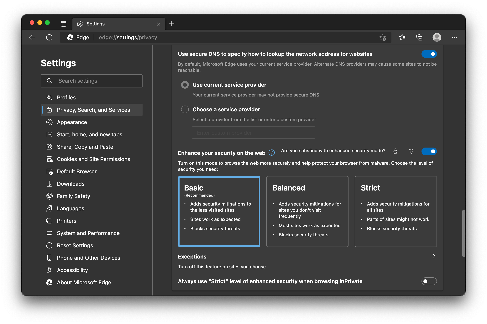

**Introduction**

In the ever-evolving world of web browsers, **Microsoft Edge** has emerged as a formidable contender. Built by Microsoft, Edge offers a fresh take on browsing, combining speed, security, and productivity. Whether you’re a Windows user or exploring other platforms, here’s everything you need to know about this versatile browser.

**1\. The Chromium Foundation**
-------------------------------

  

The current version of Edge is based on the open-source **Chromium** project. This means it shares its core with Google Chrome, allowing it to run hundreds of extensions originally designed for Chrome users. From screen readers to productivity tools, Edge accommodates a wide range of extensions. You can find them in the **Extensions menu**, accessible by clicking the three dots at the top-right corner of the browser window.

**2\. Seamless Syncing**
------------------------

  

Sign up for a **free Microsoft account**, and Edge becomes your personal assistant. It syncs your bookmarks, browsing history, passwords, and more across devices. Whether you switch between computers or use Edge on your phone, your data seamlessly follows you. Similar to Google Chrome, you can also sync your browsing information to your email account.

**3\. Performance and Speed**
-----------------------------

  

Edge has shed its reputation as a slowpoke. Reviews now place it on par with Chrome and Firefox in terms of speed. The latest version runs faster, making your browsing experience smoother. If you’re curious to try it out, head to the [Edge website](https://www.microsoft.com/en-us/edge/features) to download it for your PC, Mac, iPhone, or Android device.

**4\. Aesthetic and Functionality**
-----------------------------------

  

Edge boasts a cleaner look compared to its predecessor, Internet Explorer. It aligns with the overall Windows 11 aesthetic, emphasizing simplicity and functionality. The browser’s performance, compatibility, and security have all received significant upgrades.

**5\. Features Galore**
-----------------------

  

Let’s explore some of Edge’s standout features:

*   **Collections**: Organize and save content from the web effortlessly.
*   **Vertical Tabs**: Manage your open tabs more efficiently.
*   **Sidebar**: Access quick tools and extensions.
*   **Bing Chat**: An AI-powered chat feature.
*   **Immersive Reader**: Enhance readability by decluttering web pages.
*   **PDF Reader**: Seamlessly view and annotate PDFs.
*   **Microsoft Search**: Integrated search for productivity.
*   **Web Capture**: Capture and annotate web content.
*   **Price Comparison**: Shop smarter with built-in price comparisons.

**6\. Security and Privacy**
----------------------------

Edge incorporates **Microsoft Defender SmartScreen** to protect against malicious websites. It also offers a **Password Monitor** feature to keep your login credentials secure. Your privacy remains a priority.

**7\. Work and Productivity**
-----------------------------

  

Edge integrates with Outlook, making it a valuable tool for work. Its memory optimization ensures efficient multitasking. Whether you’re researching, collaborating, or managing emails, Edge has you covered.

**Conclusion**
--------------

Microsoft Edge isn’t just a browser; it’s a versatile companion for your digital journey. As it continues to evolve, Edge promises a seamless blend of performance, security, and convenience. So, whether you’re a Windows loyalist or an explorer of other platforms, give Edge a spin—it might just become your new favorite browser.

_Disclaimer: Information provided is based on available data as of the publication date. For the latest updates, refer to the [official Microsoft Edge website](https://www.microsoft.com/en-us/edge/features)._

* * *

**References:**

1.  [Business Insider: What Is Microsoft Edge? Everything You Need to Know](https://www.businessinsider.com/guides/tech/what-is-microsoft-edge)
2.  [Android Authority: What is Microsoft Edge? Everything you need to know](https://www.androidauthority.com/what-is-microsoft-edge-3199412/)
3.  [TechRadar: What is Microsoft Edge?](https://www.techradar.com/how-to/microsoft-edge)
4.  [How-To Geek: What You Need to Know About the New Microsoft Edge Browser](https://www.howtogeek.com/659857/what-you-need-to-know-about-the-new-microsoft-edge-browser/)