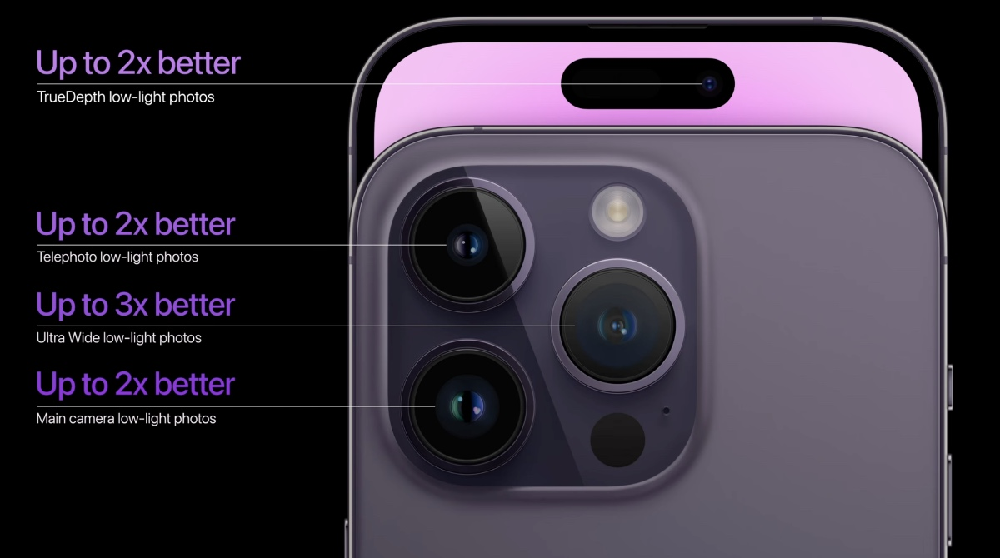

A Deep Dive into Its Advanced Features Apple has just announced its latest flagship smartphone, the iPhone 15 Max, and it is a technical marvel that pushes the boundaries of innovation and performance. In this blog post, we will take a closer look at some of the features and specifications that make this device stand out from the crowd. The iPhone 15 Max boasts a stunning 6.7-inch OLED display that delivers crisp and vibrant colours, with a resolution of 2778 x 1284 pixels and a pixel density of 458 ppi. The display also supports ProMotion technology, which dynamically adjusts the refresh rate up to 120 Hz, depending on the content and user interaction. This means smoother scrolling, animations, and gaming, as well as improved battery life. The display is also protected by Ceramic Shield, a material that is four times more resistant to drops than standard glass. The iPhone 15 Max has an IP68 rating, which means it can withstand water submersion up to 6 meters for 30 minutes. The device also features a stainless steel frame and a matte glass back, with four colour options: silver, graphite, gold, and Pacific blue. One of the most impressive aspects of the iPhone 15 Max‘s camera system, which consists of three rear cameras and one front camera.

 The rear cameras are: A 12-megapixel wide-angle camera with an f/1.6 aperture, optical image stabilization (OIS), and a new sensor-shift technology that stabilizes the sensor instead of the lens, resulting in sharper images and videos. - A 12-megapixel telephoto camera with an f/2.2 aperture, OIS, and a 3x optical zoom that allows for closer shots of distant subjects. - A 12-megapixel ultra-wide camera with an f/2.4 aperture and a 120-degree field of view that captures more of the scene in one shot. The rear cameras also support Night Mode, which automatically adjusts the exposure and colour balance to produce bright and detailed photos in low-light conditions. The cameras also support HDR video recording with Dolby Vision, which enhances the contrast and colour range of the videos. The iPhone 15 Max can record 4K video at up to 60 frames per second (fps), or 1080p video at up to 240 fps for slow-motion effects. 
 
 
 
 
 The front camera is a 12-megapixel TrueDepth camera with an f/2.2 aperture that enables Face ID, Apple's secure facial recognition system that unlocks the device with a glance. The front camera also supports Night Mode, HDR video recording with Dolby Vision, and Animoji and Memoji, which are animated characters that mimic the user's facial expressions. The iPhone 15 Max is powered by the A15 Bionic chip, which is Apple's most advanced processor to date. The A15 Bionic chip has six cores: two high-performance cores and four high-efficiency cores. The high-performance cores are up to 20% faster than the previous generation, while the high-efficiency cores are up to 25% more power-efficient. The A15 Bionic chip also has a quad-core graphics processing unit (GPU) that is up to 30% faster than the previous generation and a 16-core neural engine that is capable of performing 11 trillion operations per second. 
 
 
 
 
 The A15 Bionic chip enables various features and functions on the iPhone 15 Max, such as: 
 
 -**FaceTime HD**, which allows for high-quality video calls over Wi-Fi or cellular networks. 

  
 -**Siri** is Apple's intelligent assistant that can perform tasks and answer questions using voice commands. 

 
-**MagSafe** is a magnetic system that connects accessories and chargers to the back of the device. 

-**Wireless charginging**, which allows for charging the device without plugging in a cable. 

 
-**Apple Pay** is a secure and convenient way to pay for goods and services using NFC technology. 

 
-**Augmented reality** (AR), overlays digital information on top of the real world using the camera and sensors. 

 
 The iPhone 15 Max has a battery capacity of 3687 mAh, which provides up to 20 hours of video playback, up to 12 hours of video streaming, or up to 80 hours of audio playback. The device also supports fast charging, which can charge up to 50% in 30 minutes using a 20W power adapter (sold separately). The device also supports wireless charging up to 15W using a MagSafe charger (sold separately). 
 

 
 The iPhone 15 Max runs on iOS 15, Apple's latest operating system that offers various improvements and enhancements over iOS 14. Some of the new features and changes in iOS 15 include: 
 
**- Focus mode**, which allows users to customize their notifications and home screen based on different scenarios, such as work, personal, or sleep. 
 

**- Live Text**, which recognizes text in photos and allows users to copy, paste, translate, or search for it. - Visual Look Up, which identifies objects, animals, plants, landmarks, and art in photos and provides relevant information and links. 
 

**- Safari**, which has a redesigned interface that puts the address bar at the bottom of the screen and allows for easier tab management and navigation.
  
 
**- FaceTime**, which has new features such as spatial audio, portrait mode, SharePlay, and FaceTime links. 
 

**- Messages**, which has a new Shared with You section that shows the content that was shared by the user's contacts, such as photos, videos, articles, music, and podcasts. 

**- Maps**, which have more detailed and realistic maps, 3D landmarks, interactive globes, and transit features. 
 

**- Weather**, which has a new design that shows more information and graphics, such as precipitation, air quality, wind speed, and UV index. 
 

**- Wallet**, which can store not only credit cards and boarding passes, but also keys, IDs, and driver's licenses (in select regions). 
 

**- Privacy**, which has new features such as App Privacy Report, Mail Privacy Protection, and iCloud Private Relay. 
 
 
 The iPhone 15 Max is available in four storage options: 128 GB, 256 GB, 512 GB, and 1 TB. The device starts at $1099 in the US and can be ordered from Apple's website or authorized resellers. The device will be shipped starting from January 15th. The iPhone 15 Max is a technical marvel that offers a stunning display, a powerful processor, an amazing camera system, a long-lasting battery, and a sleek design. It is the ultimate smartphone for anyone who wants the best of the best from Apple. If you are interested in getting one for yourself or as a gift for someone else, don't hesitate to place your order today!